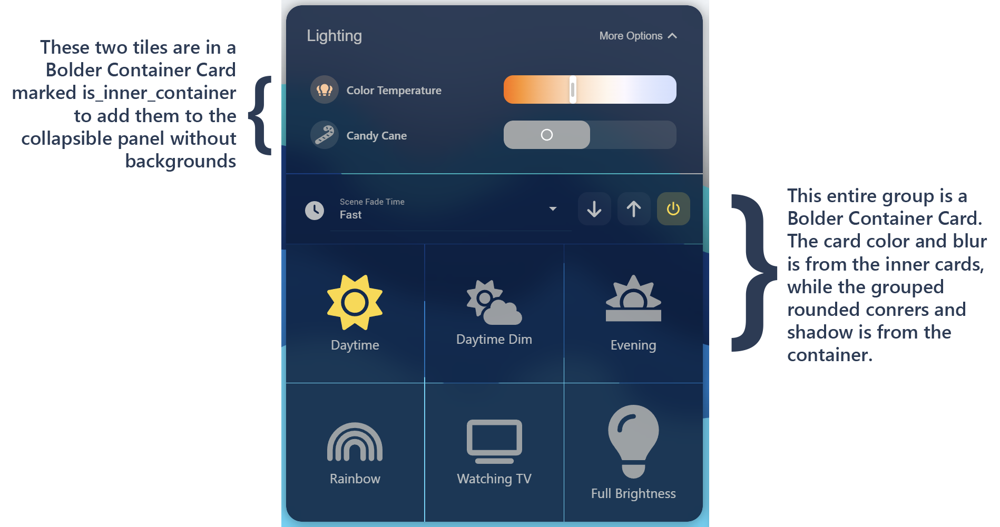

# Bolder Utility Cards

A set of [Home Assistant Dashboard Cards](https://www.home-assistant.io/dashboards/) available through the [Home Assistant Community Store](https://hacs.xyz). This is a replacement for the various "Stack-In-Card" cards, "Heading" cards, and "Collapsible" cards. that allows the inner cards and this container card to be styled differently.

| Bolder Container Card   | Bolder Header Card      | Bolder Collapsible Card |
| ----------------------- | ----------------------- | ----------------------- |
|  |  | Coming Soon |
| Ready to use | Pre-release | Not Completed |

> NOTE: This is pre-release, and currently, only Container Card is stable, with the Header card in early development.

## Table of Contents

1. [The Bolder Card Collection](#the-bolder-collection)
2. [Installation](#installation)
3. [Bolder Container Card](#bolder-container-card)
   1. [Features](#features-container-card)
   2. [Configuration](#configuration-container-card)
      1. [Options](#options-container-card)
      2. [Theme Variables](#theme-variables-container-card)
4. [Bolder Header Card](#bolder-header-card)
   1. [Features](#features-header-card)
   2. [Configuration](#configuration-header-card)
      1. [Options](#options-header-card)
      2. [Theme Variables](#theme-variables-header-card)
5. [Footnotes](#footnotes)

## The Bolder Collection

Check out the other "Bolder" cards:

| Preview                     | Card                  | Description  |
| --------------------------- | --------------------- | ------------ |
|  | [Bolder Weather Card](https://www.github.com/clarinetJWD/bolder-weather-card/) | A beautiful weather card designed for wall-mounted tablets, viewed at a distance. |

## Installation

### Manual Installation

1. Download the [bolder-utility-cards](https://www.github.com/clarinetJWD/bolder-utility-cards/releases/latest/download/bolder-utilility-cards.js).
2. Place the file in your Home Assistant's `config/www` folder.
3. Add the configuration to your `ui-lovelace.yaml`.

   ```yaml
   resources:
     - url: /local/bolder-utility-cards.js
       type: module
   ```

4. Add [configuration](#configuration-container-card) for the card in your `ui-lovelace.yaml`.

### Installation and tracking with `hacs`

1. Make sure the [HACS](https://github.com/custom-components/hacs) component is installed and working.
2. Add this repository as a custom repository `https://www.github.com/clarinetJWD/bolder-utility-cards/`
3. Search for `bolder-utility-cards` in HACS and install it.
4. **You're Probably Done!** - In newer versions of Home Assistant, you should simply be able to refresh the dashboard to see the new card now. If not, continue:
5. Depening on whether you manage your Lovelace resources via YAML (3i) or UI (3ii), you have to add the corresponding resources.
   1. **YAML:** Add the configuration to your `ui-lovelace.yaml`.

      ```yaml
      resources:
        - url: /hacsfiles/bolder-utility-cards/bolder-utility-cards.js
          type: module
      ```

   2. **UI:** Add Lovelace resource [](https://my.home-assistant.io/redirect/lovelace_resources).
      _(Alternatively go to Settings -> Dashboards -> Resources -> Add Resource)_

      ```yaml
      URL: /hacsfiles/bolder-utility-cards/bolder-utility-cards.js
      Type: JavaScript Module
      ```

6. Restart Home Assistant.
7. Add [configuration](#configuration-container-card) for the card in your `ui-lovelace.yaml` or via the UI.

## Bolder Container Card


### Features (Container Card)

* Verical and Horizontal Stack configuration.
* Allow the inner cards to retain their normal appearance while the container uses different variables. For example, you can have a stack of cards without rounded corners, but the entire group has rounded corners.
* Specify the gap between inner cards to let the background show through.
* "Inner Container" mode that disables all visual styling and simply acts as a stack.
* Full UI configuration (aside from styles).
* Customize appearance using variables in your theme file, or in the card config.

### Configuration (Container Card)

#### Minimal configuration (Container Card)

```yaml
type: custom:bolder-container-card
cards:
  - type: your-first-inner-card-type
    ...
```

#### Full configuration (Container Card)

```yaml
type: custom:bolder-container-card
mode: vertical
title: My Card Title
keep_background: true
keep_margin: false
keep_box_shadow: false
keep_border_radius: false
keep_outer_padding: false
card_background_override: red
is_inner_container: false
styles:
  - variable: title-color
    value: red
  - variable: title-size
    value: 32pt
  - variable: card-color
    value: '#0000ff'
  - variable: border-width
    value: var(--ha-card-border-width)
cards:
  - type: your-first-inner-card-type
    ...
```

#### Options (Container Card)

| Name                     | Type                  | Requirement  | Description                                                                                                                                                                                                                | Default     |
| ------------------------ | --------------------- | ------------ | ---------------------------------------------------------------------------------------------------------------------------------------------------------------------------------------------------------------------------| ----------- |
| type                     | string                | **Required** | `custom:bolder-container-card`                                                                                                                                                                                             |             |
| cards                    | [Card-Configurations] | **Required** | A collection of child card configurations.                                                                                                                                                                                 | [none]      |
| mode                     | string                | **Optional** | The direction the stack flows, either `vertical` or `horizontal`.                                                                                                                                                          | `vertical`  |
| title                    | string                | **Optional** | Title of the card, shown as a header.                                                                                                                                                                                      | `''`        |
| keep_background          | boolean               | **Optional** | When `true`, the inner cards keep their normal background color. When `false`, inner cards have their background and backdrop-filter set to `none`.                                                                        | `true`      |
| keep_margin              | boolean               | **Optional** | When `true`, the inner cards keep their normal margin (external space). When `false`, inner cards have a zero margin, plus any theme variable gap.                                                                         | `false`     |
| keep_box_shadow          | boolean               | **Optional** | When `true`, the inner cards keep their normal shadow. When `false`, inner cards have their shadow removed.                                                                                                                | `false`     |
| keep_border_radius       | boolean               | **Optional** | When `true`, the inner cards keep their normal rounded corners. When `false`, inner cards have their rounded corner radius set to `0`.                                                                                     | `false`     |
| keep_outer_padding       | boolean               | **Optional** | When `true`, the container card keeps padding between its edge and the inner cards. When `false`, there is no padding around the inner cards.                                                                              | `false`     |
| card_background_override | string (color)        | **Optional** | When set, overrides the background color of the inner cards. Note that `keep_background` must not be `true`, or it overrides this option.                                                                                  | `undefined` |
| is_inner_container       | boolean               | **Optional** | When `true`, visual aspects of the container card are removed, including: Shadow, Rounded Corners, Background, Border, Padding, and Blur/Filter. This is useful for using within other cards or collapsible card trays.    | `false`     |
| styles                   | StyleItem[]           | **Optional** | Allows setting theme style variables on a per-card basis without editing the theme.                                                                                                                                        | `[]`        |

#### Theme Variables (Container Card)

Almost every aspect of this card can be modified using theme variables (and without card-mod). These can be applied in two ways, see below.

##### Modifying your theme's YAML file (Container Card)

Just add a line to your theme's yaml file with the variable name and value to override the default:

```yaml
bolder-container-card-title-color: red # makes the card header text red.
```

##### Using card configuration

You can add styles to an individual card using it's `styles:` option. All theme variables are supported this way, and the configuration format should be:

```yaml
styles:
  - variable: title-color
    value: red
  - variable: title-size
    value: 32pt
  - variable: background
    value: '#0000ff'
  - variable: border-width
    value: var(--ha-card-border-width)
```

Note that you do not need the `bolder-container-card` prefix when specifying variables this way (though it will work if you add it). If the prefix isn't found, it will add it automatically.

For example, if you enter `variable: background`, the CSS variable created will be `--bolder-container-card-background_internal`.
The `_internal` flag is used internally only, and should never be specified.

##### All Available Variables

| Variable Name | Description | Fallback 1  | Fallback 2 | Default |
| ------------- | ----------- | ----------- | -----------| ------- |
||||||
| **Card Variables** | Variables that affect the container card. ||||
||||||
| bolder-container-card-background | The background of the container. ||| transparent |
| bolder-container-card-border-color | The border color of the container. | --ha-card-border-color | --divider-color | #e0e0e0 |
| bolder-container-card-border-style | The border style of the container. | --ha-card-border-style || solid |
| bolder-container-card-border-width | The border width of the container. | --ha-card-border-width || 0px |
| bolder-container-card-border-radius | The rounded corner radius of the container. | --ha-card-border-radius || 0px |
| bolder-container-card-box-shadow | The drop-shadow of the container. ||| --ha-card-box-shadow |
| bolder-container-card-padding | The padding between the container's edges and the inner cards ||| 0px |
| bolder-container-card-backdrop-filter | The filter/blue setting for the container. | --ha-card-backdrop-filter || none |
||||||
| **Title Text** | Variables that affect the container's header. ||||
||||||
| bolder-container-card-title-color | The color of the heading text. | --bolder-container-card-text-color | --ha-heading-card-title-color | --primary-text-color |
| bolder-container-card-title-outline-color | The outline color of the heading text. | --bolder-container-card-text-outline-color || transparent |
| bolder-container-card-title-size | The size of the heading text. | --ha-heading-card-title-font-size | --headline-font-size | 16px |
| bolder-container-card-title-weight | The weight of the heading text. | --ha-heading-card-title-font-weight || 400 |
| bolder-container-card-title-line-height | The line-height of the heading text. ||| 48px |
| bolder-container-card-title-padding | The padding around the heading text. ||| 12px 16px 16px |
| bolder-container-card-title-background | The background color of the heading area. ||| --ha-card-background |
| bolder-container-card-title-gap | The gap between the heading area and the first inner card. | --vertical-stack-card-gap | --stack-card-gap | 8px |
| bolder-container-card-title-backdrop-filter | The filter/blue setting for the heading area. | --ha-card-backdrop-filter || none |
||||||
| **Layout** | Variables that affect the card layout. ||||
||||||
| bolder-container-card-gap | The gap between inner cards. | --vertical-stack-card-gap | --stack-card-gap | 8px |

## Bolder Header Card

> NOTE: Header card is still in early development. All of the listed features are planned, but implementation, variable names, etc. may change during development.


### Features (Header Card)

* Customizable Title and Sub-Title text.
* Icon with customizable size and color.
* Full UI configuration (aside from custom styles).
* (Future Release) Custom buttons grouped on the right side with highly customizable appearance.
* Ability to use custom styles by specifying variables in either your theme file, or on the card config itself.

### Configuration (Header Card)

#### Minimal configuration (Header Card)

```yaml
type: custom:bolder-header-card
title: Hello World
```

#### Full configuration (Header Card)

```yaml
type: custom:bolder-container-card
mode: vertical
title: My Card Title
subtitle: My Card Subtitle
icon: mdi:home
styles:
  - variable: title-color
    value: red
  - variable: title-size
    value: 32pt
  - variable: card-background
    value: '#0000ff'
  - variable: border-width
    value: var(--ha-card-border-width)
  ...
```

#### Options (Header Card)

| Name      | Type         | Requirement  | Description                                                                          | Default                      |
| --------- | ------------ | ------------ | ------------------------------------------------------------------------------------ | ---------------------------- |
| type      | string       | **Required** | `custom:bolder-header-card`                                                          | `custom:bolder-header-card`  |
| title     | string       | **Optional** | Main title of the card.                                                              | `''`                         |
| subtitle  | string       | **Optional** | Subtitle, smaller below the main text.                                               | `''`                         |
| icon      | string       | **Optional** | Sets the icon to the left of the title text.                                         | `''`                         |
| styles    | StyleItem[]  | **Optional** | Allows setting theme style variables on a per-card basis without editing the theme.  | `[]`                         |

#### Theme Variables (Header Card)

Almost every aspect of this card can be modified using theme variables (and without card-mod). These can be applied in two ways, see below.

##### Modifying your theme's YAML file (Header Card)

Just add a line to your theme's yaml file with the variable name and value to override the default:

```yaml
bolder-header-card-title-color: red # makes the title text red.
```

##### Using card configuration (Header Card)

You can add styles to an individual card using it's `styles:` option. All theme variables are supported this way, and the configuration format should be:

```yaml
styles:
  - variable: title-color
    value: red
  - variable: title-size
    value: 32pt
  - variable: card-background
    value: '#0000ff'
  - variable: border-width
    value: var(--ha-card-border-width)
```

Note that you do not need the `bolder-header-card` prefix when specifying variables this way (though it will work if you add it). If the prefix isn't found, it will add it automatically.

For example, if you enter `variable: title-color`, the CSS variable created will be `--bolder-header-card-title-color_internal`.
The `_internal` flag is used internally only, and should never be specified.

##### All Available Variables (Header Card)

| Variable Name | Description | Fallback 1  | Fallback 2 | Default |
| ------------- | ----------- | ----------- | -----------| ------- |
||||||
| **Card Variables** | Variables that affect the header card. ||||
||||||
| bolder-header-card-background       |  | --ha-card-background || --card-background-color |
| bolder-header-card-border-color     |  | --ha-card-border-color | --divider-color | #e0e0e0 |
| bolder-header-card-border-style     |  | --ha-card-border-style || solid |
| bolder-header-card-border-width     |  | --ha-card-border-width || 0px |
| bolder-header-card-border-radius    |  | --ha-card-border-radius || 0px |
| bolder-header-card-box-shadow       |  ||| --ha-card-box-shadow |
| bolder-header-card-backdrop-filter  |  | --ha-card-backdrop-filter || none |
| bolder-header-card-gap              |  ||| 0px |
| bolder-header-card-padding          |  ||| 12px 16px 16px |
||||||
| **Header** |  ||||
||||||
| bolder-header-card-header-padding  |  ||| 0 0 0 0 |
| bolder-header-card-header-margin   |  ||| 0 0 0 0 |
| bolder-header-card-header-gap      |  ||| 0 |
||||||
| **Title Text** |  ||||
||||||
| bolder-header-card-title-color          |  | --bolder-header-card-text-color | --ha-heading-card-title-color | --primary-text-color |
| bolder-header-card-title-outline-color  |  | --bolder-header-card-text-outline-color || transparent |
| bolder-header-card-title-size           |  | --ha-heading-card-title-font-size | --headline-font-size | 16px |
| bolder-header-card-title-weight         |  | --ha-heading-card-title-font-weight || 400 |
| bolder-header-card-title-line-height    |  ||| normal |
| bolder-header-card-title-padding        |  ||| 0 0 0 0 |
| bolder-header-card-title-margin         |  ||| 0 0 0 0 |
||||||
| **Subtitle Text** |  ||||
||||||
| bolder-header-card-subtitle-color          |  | --bolder-header-card-text-color | --ha-heading-card-subtitle-color | --secondary-text-color |
| bolder-header-card-subtitle-outline-color  |  | --bolder-header-card-text-outline-color || transparent |
| bolder-header-card-subtitle-size           |  | --ha-heading-card-subtitle-font-size | --mdc-typography-subtitle1-font-size | 1rem |
| bolder-header-card-subtitle-weight         |  | --ha-heading-card-subtitle-font-weight || inherit |
| bolder-header-card-subtitle-line-height    |  ||| normal |
| bolder-header-card-subtitle-padding        |  ||| 0 0 0 0 |
| bolder-header-card-subtitle-margin         |  ||| 0 0 0 0 |
||||||
| **Icon** |  ||||
||||||
| bolder-header-card-icon-size                |  ||| calc(var(--bolder-header-card-title-size_internal) * 1.5) |
| bolder-header-card-icon-gap                 |  ||| 10px |
| bolder-header-card-icon-vertical-alignment  |  ||| center |
| bolder-header-card-icon-color               |  ||| --primary-text-color |
| bolder-header-card-icon-background          |  ||| none |
| bolder-header-card-icon-padding             |  ||| 0 0 0 0 |
| bolder-header-card-icon-margin              |  ||| 0 0 0 0 |
| bolder-header-card-icon-opacity             |  ||| 1.0 |
| bolder-header-card-icon-border-radius       |  ||| 10px |
||||||
| bolder-header-card-icon-hover-color          |  | --bolder-header-card-icon-color || --primary-text-color |
| bolder-header-card-icon-hover-background     |  | --bolder-header-card-icon-background || none |
| bolder-header-card-icon-hover-padding        |  | --bolder-header-card-icon-padding || 0 0 0 0 |
| bolder-header-card-icon-hover-margin         |  | --bolder-header-card-icon-margin || 0 0 0 0 |
| bolder-header-card-icon-hover-opacity        |  | --bolder-header-card-icon-opacity || 1.0 |
| bolder-header-card-icon-hover-border-radius  |  ||| 10px |

## Footnotes

Note that though the languages are specified, currently they are unused and all English.
I hope to be able to get full UI configuration support, where they will be used, but that is a future job.
If you'd like to contribute translations to your language, create a new branch, modify the file, and make a pull request.

Supported languages: `ar`, `bg`, `ca`, `cs`, `cy`, `da`, `de`, `el`,`en`, `es`, `et`, `fi`, `fr`, `he`, `hu`, `hr`, `id`, `is`, `it`, `ko`, `lb`, `lt`, `nb`, `nl`, `pl`, `pt`, `pt-BR`, `ro`, `ru`, `sk`, `sl`, `sr`, `sr-Latn`, `sv`, `th`, `tr`, `uk`, `ur`, `vi`, `zh-CN`, `zh-TW`
